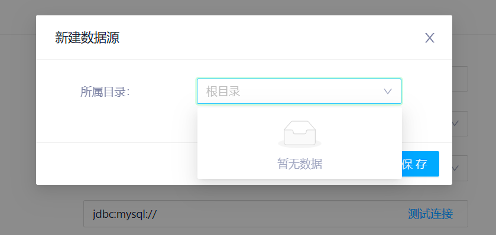
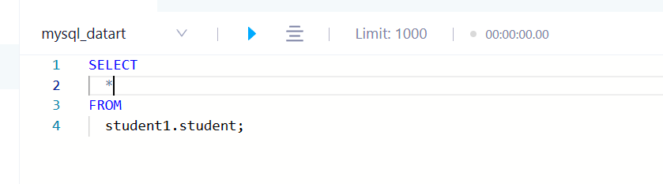
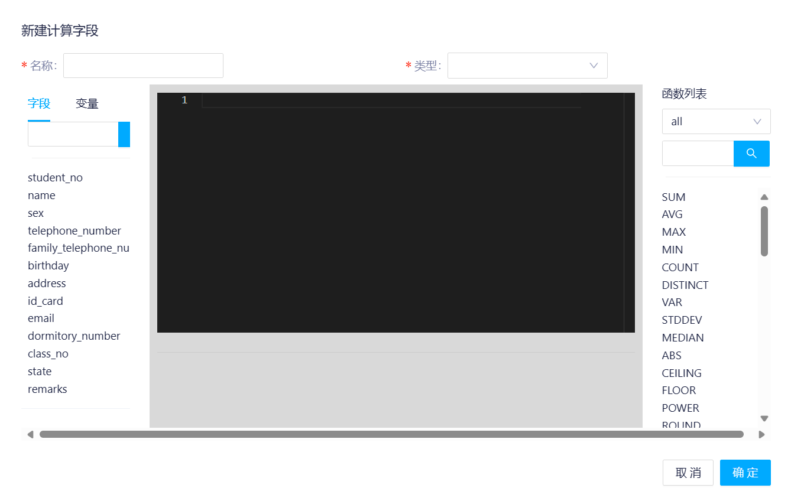
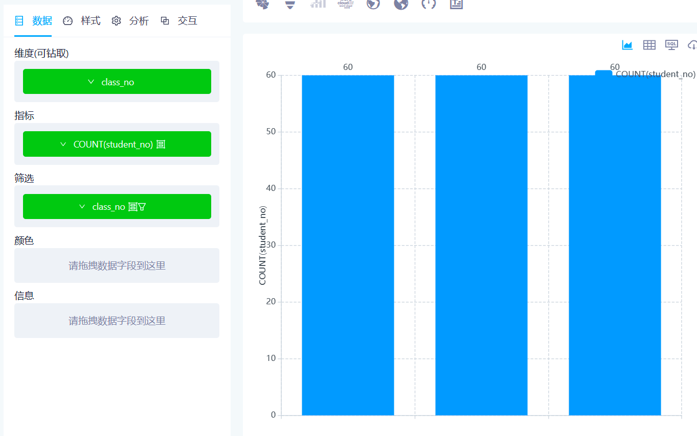

<h1 style="font-size:3.3em;color:skyblue;text-align:center">datart学习笔记</h1>


# 概述

## 数据可视化

随着实时报表、BI、实时大屏、仪表板、甚至数字孪生等交互式数据可视化类产品应用越来越广，数据可视化领域备受关注

数据可视化，百度百科将其定义为数据的视觉表现形式，是一种以概要形式抽提出来的信息，包括相应信息单位的各种属性和变量

数据可视化借助图形化手段，通过可视化插件库，各式各样的图表种类和主题可供选择，可以清晰有效地传达和沟通信息，通过直观、美观的图表、大屏来传达关键数据信息和展现数据特征，从而帮助用户实现对零散且又繁杂的数据集进行深入洞察


## datart

datart 是新一代数据可视化开放平台，支持各类企业数据可视化场景需求，如创建和使用报表、仪表板和大屏，进行可视化数据分析，构建可视化数据应用等。由原 davinci 主创团队出品，datart 更加开放、可塑和智能，并在数据与艺术之间寻求最佳平衡。


## 项目地址

* [github](https://github.com/running-elephant/datart)
* [码云](https://gitee.com/running-elephant/datart?_from=gitee_search)
* [官网](https://running-elephant.gitee.io/datart-docs/)


## 设计理念

* **开放**
* **流程标准化**
* **交互标准化**
* **插件标准化**
* **可塑**
* **智能**


## 功能特性


## 在线体验

http://datart-demo.retech.cc

* 用户名：demo

* 密码：123456


# 部署

## 本地部署

### 下载项目

打开项目的远程仓库

https://gitee.com/running-elephant/datart?_from=gitee_search


在右边找到发行版按钮


点击下载


### 解压项目

将下载好的datart-server-*-install.zip解压


解压之后的文件结构如下

```sh
├── bin               # 执行脚本目录
├── config            # 配置文件目录
├── (files)           # 应用生成文件目录；应用运行后生成
├── lib               # 项目依赖目录
├── (logs)            # 日志目录；应用运行后生成
├── static            # 静态资源目录
├── nohup.out         # 缺省日志输出文件
├── Deployment.md     # 部署说明
├── Dockerfile
└── LICENSE
```


```sh
PS D:\opensoft\datart\datart-server> ls


    目录: D:\opensoft\datart\datart-server


Mode                 LastWriteTime         Length Name
----                 -------------         ------ ----
d-----         2023/3/31     17:10                bin
d-----         2023/3/31     17:10                config
d-----          2023/4/7     14:26                lib
d-----          2023/4/7     14:26                static
------         2023/3/31     10:33           6758 Deployment.md
------         2023/3/31     10:33            341 Dockerfile
------         2023/3/31     10:33          11357 LICENSE
------         2023/3/31     10:33           4308 README.md


PS D:\opensoft\datart\datart-server>
```


### 启动应用

运行 `bin` 目录下的脚本来启动应用

```sh
${DATART_HOME}/bin/datart-server.sh start       # 启动
${DATART_HOME}/bin/datart-server.sh stop        # 停止
${DATART_HOME}/bin/datart-server.sh status      # 查看状态
${DATART_HOME}/bin/datart-server.sh restart     # 重启
```


运行后的日志输出如下：

```sh
【********* Invalid database configuration. Datart is running in demo mode *********】
2023-09-11 14:45:38.082 INFO  org.hibernate.validator.internal.util.Version : HV000001: Hibernate Validator 6.1.7.Final
2023-09-11 14:45:38.119 INFO  datart.DatartServerApplication : Starting DatartServerApplication v1.0.0-rc.2 using Java 1.8.0_332 on mao with PID 29604 (D:\opensoft\datart\datart-server\lib\datart-server-1.0.0-rc.2.jar started by mao in D:\opensoft\datart\datart-server)
2023-09-11 14:45:38.119 INFO  datart.DatartServerApplication : The following profiles are active: demo
2023-09-11 14:45:38.820 INFO  o.s.d.r.config.RepositoryConfigurationDelegate : Multiple Spring Data modules found, entering strict repository configuration mode!
2023-09-11 14:45:38.822 INFO  o.s.d.r.config.RepositoryConfigurationDelegate : Bootstrapping Spring Data LDAP repositories in DEFAULT mode.
2023-09-11 14:45:38.881 INFO  o.s.d.r.config.RepositoryConfigurationDelegate : Finished Spring Data repository scanning in 54 ms. Found 0 LDAP repository interfaces.
2023-09-11 14:45:38.891 INFO  o.s.d.r.config.RepositoryConfigurationDelegate : Multiple Spring Data modules found, entering strict repository configuration mode!
2023-09-11 14:45:38.892 INFO  o.s.d.r.config.RepositoryConfigurationDelegate : Bootstrapping Spring Data Redis repositories in DEFAULT mode.
2023-09-11 14:45:38.934 INFO  o.s.d.r.config.RepositoryConfigurationDelegate : Finished Spring Data repository scanning in 33 ms. Found 0 Redis repository interfaces.
2023-09-11 14:45:39.241 INFO  o.s.c.s.PostProcessorRegistrationDelegate$BeanPostProcessorChecker : Bean 'org.apache.shiro.spring.boot.autoconfigure.ShiroBeanAutoConfiguration' of type [org.apache.shiro.spring.boot.autoconfigure.ShiroBeanAutoConfiguration$$EnhancerBySpringCGLIB$$6cdaa7cd] is not eligible for getting processed by all BeanPostProcessors (for example: not eligible for auto-proxying)
2023-09-11 14:45:39.272 INFO  o.s.c.s.PostProcessorRegistrationDelegate$BeanPostProcessorChecker : Bean 'org.apache.shiro.spring.boot.autoconfigure.ShiroAnnotationProcessorAutoConfiguration' of type [org.apache.shiro.spring.boot.autoconfigure.ShiroAnnotationProcessorAutoConfiguration$$EnhancerBySpringCGLIB$$6f6de672] is not eligible for getting processed by all BeanPostProcessors (for example: not eligible for auto-proxying)
2023-09-11 14:45:39.447 INFO  o.s.c.s.PostProcessorRegistrationDelegate$BeanPostProcessorChecker : Bean 'eventBus' of type [org.apache.shiro.event.support.DefaultEventBus] is not eligible for getting processed by all BeanPostProcessors (for example: not eligible for auto-proxying)
2023-09-11 14:45:39.466 INFO  o.s.c.s.PostProcessorRegistrationDelegate$BeanPostProcessorChecker : Bean 'org.apache.shiro.spring.boot.autoconfigure.ShiroAutoConfiguration' of type [org.apache.shiro.spring.boot.autoconfigure.ShiroAutoConfiguration$$EnhancerBySpringCGLIB$$32da499d] is not eligible for getting processed by all BeanPostProcessors (for example: not eligible for auto-proxying)
2023-09-11 14:45:39.470 INFO  o.s.c.s.PostProcessorRegistrationDelegate$BeanPostProcessorChecker : Bean 'securityConfiguration' of type [datart.security.manager.shiro.SecurityConfiguration$$EnhancerBySpringCGLIB$$91eb1d0e] is not eligible for getting processed by all BeanPostProcessors (for example: not eligible for auto-proxying)
2023-09-11 14:45:39.506 INFO  o.s.c.s.PostProcessorRegistrationDelegate$BeanPostProcessorChecker : Bean 'mybatis-org.mybatis.spring.boot.autoconfigure.MybatisProperties' of type [org.mybatis.spring.boot.autoconfigure.MybatisProperties] is not eligible for getting processed by all BeanPostProcessors (for example: not eligible for auto-proxying)
2023-09-11 14:45:39.511 INFO  o.s.c.s.PostProcessorRegistrationDelegate$BeanPostProcessorChecker : Bean 'org.mybatis.spring.boot.autoconfigure.MybatisAutoConfiguration' of type [org.mybatis.spring.boot.autoconfigure.MybatisAutoConfiguration$$EnhancerBySpringCGLIB$$8c961b4d] is not eligible for getting processed by all BeanPostProcessors (for example: not eligible for auto-proxying)
2023-09-11 14:45:39.517 INFO  o.s.c.s.PostProcessorRegistrationDelegate$BeanPostProcessorChecker : Bean 'com.alibaba.druid.spring.boot.autoconfigure.DruidDataSourceAutoConfigure' of type [com.alibaba.druid.spring.boot.autoconfigure.DruidDataSourceAutoConfigure$$EnhancerBySpringCGLIB$$736dbf8f] is not eligible for getting processed by all BeanPostProcessors (for example: not eligible for auto-proxying)
2023-09-11 14:45:39.519 INFO  c.a.d.s.b.a.DruidDataSourceAutoConfigure : Init DruidDataSource
2023-09-11 14:45:39.556 INFO  o.s.c.s.PostProcessorRegistrationDelegate$BeanPostProcessorChecker : Bean 'spring.datasource-org.springframework.boot.autoconfigure.jdbc.DataSourceProperties' of type [org.springframework.boot.autoconfigure.jdbc.DataSourceProperties] is not eligible for getting processed by all BeanPostProcessors (for example: not eligible for auto-proxying)
2023-09-11 14:45:39.630 ERROR com.alibaba.druid.pool.DruidDataSource : testWhileIdle is true, validationQuery not set
2023-09-11 14:45:39.638 INFO  com.alibaba.druid.pool.DruidDataSource : {dataSource-1} inited
2023-09-11 14:45:39.638 INFO  o.s.c.s.PostProcessorRegistrationDelegate$BeanPostProcessorChecker : Bean 'dataSource' of type [com.alibaba.druid.spring.boot.autoconfigure.DruidDataSourceWrapper] is not eligible for getting processed by all BeanPostProcessors (for example: not eligible for auto-proxying)
2023-09-11 14:45:39.668 INFO  o.s.c.s.PostProcessorRegistrationDelegate$BeanPostProcessorChecker : Bean 'org.springframework.boot.autoconfigure.jdbc.DataSourceInitializerInvoker' of type [org.springframework.boot.autoconfigure.jdbc.DataSourceInitializerInvoker] is not eligible for getting processed by all BeanPostProcessors (for example: not eligible for auto-proxying)
2023-09-11 14:45:39.719 INFO  o.s.c.s.PostProcessorRegistrationDelegate$BeanPostProcessorChecker : Bean 'sqlSessionFactory' of type [org.apache.ibatis.session.defaults.DefaultSqlSessionFactory] is not eligible for getting processed by all BeanPostProcessors (for example: not eligible for auto-proxying)
2023-09-11 14:45:39.728 INFO  o.s.c.s.PostProcessorRegistrationDelegate$BeanPostProcessorChecker : Bean 'sqlSessionTemplate' of type [org.mybatis.spring.SqlSessionTemplate] is not eligible for getting processed by all BeanPostProcessors (for example: not eligible for auto-proxying)
2023-09-11 14:45:39.779 INFO  o.s.c.s.PostProcessorRegistrationDelegate$BeanPostProcessorChecker : Bean 'userMapperExt' of type [org.mybatis.spring.mapper.MapperFactoryBean] is not eligible for getting processed by all BeanPostProcessors (for example: not eligible for auto-proxying)
2023-09-11 14:45:39.784 INFO  o.s.c.s.PostProcessorRegistrationDelegate$BeanPostProcessorChecker : Bean 'userMapperExt' of type [com.sun.proxy.$Proxy102] is not eligible for getting processed by all BeanPostProcessors (for example: not eligible for auto-proxying)
2023-09-11 14:45:39.885 INFO  o.s.c.s.PostProcessorRegistrationDelegate$BeanPostProcessorChecker : Bean 'roleMapperExt' of type [org.mybatis.spring.mapper.MapperFactoryBean] is not eligible for getting processed by all BeanPostProcessors (for example: not eligible for auto-proxying)
2023-09-11 14:45:39.887 INFO  o.s.c.s.PostProcessorRegistrationDelegate$BeanPostProcessorChecker : Bean 'roleMapperExt' of type [com.sun.proxy.$Proxy106] is not eligible for getting processed by all BeanPostProcessors (for example: not eligible for auto-proxying)
2023-09-11 14:45:39.909 INFO  o.s.c.s.PostProcessorRegistrationDelegate$BeanPostProcessorChecker : Bean 'relRoleResourceMapperExt' of type [org.mybatis.spring.mapper.MapperFactoryBean] is not eligible for getting processed by all BeanPostProcessors (for example: not eligible for auto-proxying)
2023-09-11 14:45:39.910 INFO  o.s.c.s.PostProcessorRegistrationDelegate$BeanPostProcessorChecker : Bean 'relRoleResourceMapperExt' of type [com.sun.proxy.$Proxy109] is not eligible for getting processed by all BeanPostProcessors (for example: not eligible for auto-proxying)
2023-09-11 14:45:39.933 INFO  o.s.c.s.PostProcessorRegistrationDelegate$BeanPostProcessorChecker : Bean 'requestScopePermissionDataCache' of type [org.springframework.aop.scope.ScopedProxyFactoryBean] is not eligible for getting processed by all BeanPostProcessors (for example: not eligible for auto-proxying)
2023-09-11 14:45:39.934 INFO  o.s.c.s.PostProcessorRegistrationDelegate$BeanPostProcessorChecker : Bean 'requestScopePermissionDataCache' of type [datart.security.manager.RequestScopePermissionDataCache$$EnhancerBySpringCGLIB$$d5557d78] is not eligible for getting processed by all BeanPostProcessors (for example: not eligible for auto-proxying)
2023-09-11 14:45:39.935 INFO  o.s.c.s.PostProcessorRegistrationDelegate$BeanPostProcessorChecker : Bean 'threadScopePermissionDataCache' of type [datart.security.manager.ThreadScopePermissionDataCache] is not eligible for getting processed by all BeanPostProcessors (for example: not eligible for auto-proxying)
2023-09-11 14:45:39.936 INFO  o.s.c.s.PostProcessorRegistrationDelegate$BeanPostProcessorChecker : Bean 'permissionDataCache' of type [datart.security.manager.PermissionDataCache] is not eligible for getting processed by all BeanPostProcessors (for example: not eligible for auto-proxying)
2023-09-11 14:45:39.938 INFO  o.s.c.s.PostProcessorRegistrationDelegate$BeanPostProcessorChecker : Bean 'passwordCredentialsMatcher' of type [datart.security.manager.shiro.PasswordCredentialsMatcher] is not eligible for getting processed by all BeanPostProcessors (for example: not eligible for auto-proxying)
2023-09-11 14:45:39.945 INFO  o.s.c.s.PostProcessorRegistrationDelegate$BeanPostProcessorChecker : Bean 'realm' of type [datart.security.manager.shiro.DatartRealm] is not eligible for getting processed by all BeanPostProcessors (for example: not eligible for auto-proxying)
2023-09-11 14:45:39.957 INFO  o.s.c.s.PostProcessorRegistrationDelegate$BeanPostProcessorChecker : Bean 'sessionStorageEvaluator' of type [org.apache.shiro.mgt.DefaultSessionStorageEvaluator] is not eligible for getting processed by all BeanPostProcessors (for example: not eligible for auto-proxying)
2023-09-11 14:45:39.958 INFO  o.s.c.s.PostProcessorRegistrationDelegate$BeanPostProcessorChecker : Bean 'subjectDAO' of type [org.apache.shiro.mgt.DefaultSubjectDAO] is not eligible for getting processed by all BeanPostProcessors (for example: not eligible for auto-proxying)
2023-09-11 14:45:39.959 INFO  o.s.c.s.PostProcessorRegistrationDelegate$BeanPostProcessorChecker : Bean 'subjectFactory' of type [org.apache.shiro.mgt.DefaultSubjectFactory] is not eligible for getting processed by all BeanPostProcessors (for example: not eligible for auto-proxying)
2023-09-11 14:45:39.960 INFO  o.s.c.s.PostProcessorRegistrationDelegate$BeanPostProcessorChecker : Bean 'authenticationStrategy' of type [org.apache.shiro.authc.pam.AtLeastOneSuccessfulStrategy] is not eligible for getting processed by all BeanPostProcessors (for example: not eligible for auto-proxying)
2023-09-11 14:45:39.960 INFO  o.s.c.s.PostProcessorRegistrationDelegate$BeanPostProcessorChecker : Bean 'authenticator' of type [org.apache.shiro.authc.pam.ModularRealmAuthenticator] is not eligible for getting processed by all BeanPostProcessors (for example: not eligible for auto-proxying)
2023-09-11 14:45:39.961 INFO  o.s.c.s.PostProcessorRegistrationDelegate$BeanPostProcessorChecker : Bean 'authorizer' of type [org.apache.shiro.authz.ModularRealmAuthorizer] is not eligible for getting processed by all BeanPostProcessors (for example: not eligible for auto-proxying)
2023-09-11 14:45:39.962 INFO  o.s.c.s.PostProcessorRegistrationDelegate$BeanPostProcessorChecker : Bean 'sessionDAO' of type [org.apache.shiro.session.mgt.eis.MemorySessionDAO] is not eligible for getting processed by all BeanPostProcessors (for example: not eligible for auto-proxying)
2023-09-11 14:45:39.963 INFO  o.s.c.s.PostProcessorRegistrationDelegate$BeanPostProcessorChecker : Bean 'sessionFactory' of type [org.apache.shiro.session.mgt.SimpleSessionFactory] is not eligible for getting processed by all BeanPostProcessors (for example: not eligible for auto-proxying)
2023-09-11 14:45:39.963 INFO  o.s.c.s.PostProcessorRegistrationDelegate$BeanPostProcessorChecker : Bean 'sessionManager' of type [org.apache.shiro.session.mgt.DefaultSessionManager] is not eligible for getting processed by all BeanPostProcessors (for example: not eligible for auto-proxying)
2023-09-11 14:45:39.965 INFO  o.s.c.s.PostProcessorRegistrationDelegate$BeanPostProcessorChecker : Bean 'securityManager' of type [org.apache.shiro.mgt.DefaultSecurityManager] is not eligible for getting processed by all BeanPostProcessors (for example: not eligible for auto-proxying)
2023-09-11 14:45:39.974 INFO  o.s.c.s.PostProcessorRegistrationDelegate$BeanPostProcessorChecker : Bean 'authorizationAttributeSourceAdvisor' of type [org.apache.shiro.spring.security.interceptor.AuthorizationAttributeSourceAdvisor] is not eligible for getting processed by all BeanPostProcessors (for example: not eligible for auto-proxying)
2023-09-11 14:45:40.414 INFO  o.s.boot.web.embedded.tomcat.TomcatWebServer : Tomcat initialized with port(s): 8080 (http)
2023-09-11 14:45:40.422 INFO  org.apache.coyote.http11.Http11NioProtocol : Initializing ProtocolHandler ["http-nio-0.0.0.0-8080"]
2023-09-11 14:45:40.422 INFO  org.apache.catalina.core.StandardService : Starting service [Tomcat]
2023-09-11 14:45:40.422 INFO  org.apache.catalina.core.StandardEngine : Starting Servlet engine: [Apache Tomcat/9.0.43]
2023-09-11 14:45:40.898 INFO  o.a.c.core.ContainerBase.[Tomcat].[localhost].[/] : Initializing Spring embedded WebApplicationContext
2023-09-11 14:45:40.899 INFO  o.s.b.w.s.c.ServletWebServerApplicationContext : Root WebApplicationContext: initialization completed in 2747 ms
2023-09-11 14:45:41.140 INFO  o.s.ldap.core.support.AbstractContextSource : Property 'userDn' not set - anonymous context will be used for read-write operations
2023-09-11 14:45:41.479 INFO  org.quartz.impl.StdSchedulerFactory : Using default implementation for ThreadExecutor
2023-09-11 14:45:41.489 INFO  org.quartz.core.SchedulerSignalerImpl : Initialized Scheduler Signaller of type: class org.quartz.core.SchedulerSignalerImpl
2023-09-11 14:45:41.490 INFO  org.quartz.core.QuartzScheduler : Quartz Scheduler v.2.3.2 created.
2023-09-11 14:45:41.494 INFO  o.s.scheduling.quartz.LocalDataSourceJobStore : Using db table-based data access locking (synchronization).
2023-09-11 14:45:41.496 INFO  o.s.scheduling.quartz.LocalDataSourceJobStore : JobStoreCMT initialized.
2023-09-11 14:45:41.497 INFO  org.quartz.core.QuartzScheduler : Scheduler meta-data: Quartz Scheduler (v2.3.2) 'DatartScheduleCluster' with instanceId 'mao1694414741481'
  Scheduler class: 'org.quartz.core.QuartzScheduler' - running locally.
  NOT STARTED.
  Currently in standby mode.
  Number of jobs executed: 0
  Using thread pool 'org.quartz.simpl.SimpleThreadPool' - with 10 threads.
  Using job-store 'org.springframework.scheduling.quartz.LocalDataSourceJobStore' - which supports persistence. and is clustered.

2023-09-11 14:45:41.497 INFO  org.quartz.impl.StdSchedulerFactory : Quartz scheduler 'DatartScheduleCluster' initialized from an externally provided properties instance.
2023-09-11 14:45:41.498 INFO  org.quartz.impl.StdSchedulerFactory : Quartz scheduler version: 2.3.2
2023-09-11 14:45:41.498 INFO  org.quartz.core.QuartzScheduler : JobFactory set to: org.springframework.scheduling.quartz.SpringBeanJobFactory@43f99817
2023-09-11 14:45:42.463 INFO  s.d.s.w.PropertySourcedRequestMappingHandlerMapping : Mapped URL path [/v2/api-docs] onto method [springfox.documentation.swagger2.web.Swagger2Controller#getDocumentation(String, HttpServletRequest)]
2023-09-11 14:45:42.545 INFO  o.s.security.web.DefaultSecurityFilterChain : Will secure Ant [pattern='/api/v1/tpa'] with []
2023-09-11 14:45:42.573 INFO  o.s.security.web.DefaultSecurityFilterChain : Will secure any request with [org.springframework.security.web.context.request.async.WebAsyncManagerIntegrationFilter@2634d000, org.springframework.security.web.context.SecurityContextPersistenceFilter@3ba8ef4e, org.springframework.security.web.header.HeaderWriterFilter@632b96b8, org.springframework.security.web.authentication.logout.LogoutFilter@1764e45e, org.springframework.security.web.savedrequest.RequestCacheAwareFilter@a1a72d4, org.springframework.security.web.servletapi.SecurityContextHolderAwareRequestFilter@21dd9203, org.springframework.security.web.authentication.AnonymousAuthenticationFilter@1642968c, org.springframework.security.web.session.SessionManagementFilter@5a07ae2f, org.springframework.security.web.access.ExceptionTranslationFilter@34d5eac]
2023-09-11 14:45:42.738 INFO  o.s.scheduling.concurrent.ThreadPoolTaskExecutor : Initializing ExecutorService 'applicationTaskExecutor'
2023-09-11 14:45:42.777 INFO  o.s.b.a.web.servlet.WelcomePageHandlerMapping : Adding welcome page: ServletContext resource [/index.html]
2023-09-11 14:45:43.000 INFO  org.apache.coyote.http11.Http11NioProtocol : Starting ProtocolHandler ["http-nio-0.0.0.0-8080"]
2023-09-11 14:45:43.014 INFO  o.s.boot.web.embedded.tomcat.TomcatWebServer : Tomcat started on port(s): 8080 (http) with context path ''
2023-09-11 14:45:43.015 INFO  s.d.s.web.plugins.DocumentationPluginsBootstrapper : Context refreshed
2023-09-11 14:45:43.024 INFO  s.d.s.web.plugins.DocumentationPluginsBootstrapper : Found 1 custom documentation plugin(s)
2023-09-11 14:45:43.118 INFO  s.d.spring.web.scanners.ApiListingReferenceScanner : Scanning for api listing references
2023-09-11 14:45:43.454 INFO  s.d.s.w.r.operation.CachingOperationNameGenerator : Generating unique operation named: executeUsingPOST_1
2023-09-11 14:45:43.504 INFO  s.d.s.w.r.operation.CachingOperationNameGenerator : Generating unique operation named: downloadFileUsingGET_1
2023-09-11 14:45:43.509 INFO  s.d.s.w.r.operation.CachingOperationNameGenerator : Generating unique operation named: executeUsingPOST_2
2023-09-11 14:45:43.571 INFO  s.d.s.w.r.operation.CachingOperationNameGenerator : Generating unique operation named: checkNameUsingPOST_1
2023-09-11 14:45:43.573 INFO  s.d.s.w.r.operation.CachingOperationNameGenerator : Generating unique operation named: createUsingPOST_1
2023-09-11 14:45:43.577 INFO  s.d.s.w.r.operation.CachingOperationNameGenerator : Generating unique operation named: getSubjectVariableValuesUsingGET_1
2023-09-11 14:45:43.591 INFO  s.d.s.w.r.operation.CachingOperationNameGenerator : Generating unique operation named: listArchivedUsingGET_1
2023-09-11 14:45:43.593 INFO  s.d.s.w.r.operation.CachingOperationNameGenerator : Generating unique operation named: unarchiveUsingPUT_1
2023-09-11 14:45:43.659 INFO  s.d.s.w.r.operation.CachingOperationNameGenerator : Generating unique operation named: getDatachartUsingGET_1
2023-09-11 14:45:43.668 WARN  s.d.s.w.readers.parameter.ParameterDataTypeReader : Trying to infer dataType datart.server.base.transfer.ImportStrategy
2023-09-11 14:45:43.720 INFO  o.s.scheduling.quartz.SchedulerFactoryBean : Starting Quartz Scheduler now
2023-09-11 14:45:43.740 INFO  o.s.scheduling.quartz.LocalDataSourceJobStore : ClusterManager: detected 1 failed or restarted instances.
2023-09-11 14:45:43.740 INFO  o.s.scheduling.quartz.LocalDataSourceJobStore : ClusterManager: Scanning for instance "TL-PC1657555326041"'s failed in-progress jobs.
2023-09-11 14:45:43.741 INFO  org.quartz.core.QuartzScheduler : Scheduler DatartScheduleCluster_$_mao1694414741481 started.
2023-09-11 14:45:43.750 INFO  datart.DatartServerApplication : Started DatartServerApplication in 6.039 seconds (JVM running for 6.42)
2023-09-11 14:45:43.751 INFO  datart.server.config.AppModeStartConfig : The application is running in PLATFORM tenant-management-mode.
```


**直接启动时使用的是内置的 H2 数据库作为应用数据库，升级应用时无法迁移数据，不建议在生产环境使用**


### 配置应用数据库

datart 目前支持配置 MySQL 作为应用数据库；**需要 MySQL 5.7 及以上版本**

1.0.0-beta.2 版本以前，需要手动执行bin/datart.sql来初始化数据库。此版本及以上版本，创建好数据库即可，在初次连接时会自动初始化数据库


```sql
CREATE DATABASE `datart` CHARACTER SET 'utf8' COLLATE 'utf8_general_ci';
```


编辑 `config/datart.conf` 文件完成配置


更改项：

```properties
datasource.ip=localhost           # 数据库IP或域名
datasource.port=3306              # 数据库端口
datasource.database=datart        # 数据库名称
datasource.username=root          # 用户名
datasource.password=root          # 密码
```


保存后重启


再次运行时会创建表


### 访问

http://127.0.0.1:8080


内置初始账户，用户名 `demo` 密码 `123456`


## Docker部署

datart 在 dockerhub 中的公共镜像地址为 [datart/datart](https://hub.docker.com/r/datart/datart)


### 搜索镜像

```sh
PS C:\Users\mao\Desktop> docker search datart
NAME                          DESCRIPTION                                      STARS     OFFICIAL   AUTOMATED
datart/datart                 Datart数据可视化开放平台官方镜像                 3
datartist/docker101tutorial                                                    0
tbcheng/datart                跑象科技可视化产品 datart， docker镜像，一键…   0
ifanzero/datart                                                                0
vishwasw75/datart_solutions                                                    0
PS C:\Users\mao\Desktop>
```


### 拉取镜像

```sh
PS C:\Users\mao\Desktop> docker pull datart/datart
Using default tag: latest
latest: Pulling from datart/datart
5040bd298390: Already exists
fce5728aad85: Already exists
76610ec20bf5: Pull complete
60170fec2151: Pull complete
e98f73de8f0d: Pull complete
11f7af24ed9c: Pull complete
49e2d6393f32: Pull complete
bb9cdec9c7f3: Pull complete
dc4c03d41d8b: Pull complete
7fea1d3e1bbf: Pull complete
924e3b7c4f03: Pull complete
92629e12f3c7: Pull complete
8aba1a3668fc: Pull complete
4f4fb700ef54: Pull complete
Digest: sha256:af244a1d968515bfb2ef58332c2555f17a799134f598161a2b90ca6afd8e72c8
Status: Downloaded newer image for datart/datart:latest
docker.io/datart/datart:latest

What's Next?
  View summary of image vulnerabilities and recommendations → docker scout quickview datart/datart
PS C:\Users\mao\Desktop>
```


### 查看镜像

```sh
docker images
```

```sh
PS C:\Users\mao\Desktop> docker images
REPOSITORY                                                TAG                                                                          IMAGE ID       CREATED         SIZE
mysql-jxstar                                              latest                                                                       945a899571c2   3 days ago      448MB
nginx                                                     <none>                                                                       89da1fb6dcb9   6 weeks ago     187MB
hubproxy.docker.internal:5555/docker/desktop-kubernetes   kubernetes-v1.27.2-cni-v1.2.0-critools-v1.27.0-cri-dockerd-v0.3.2-1-debian   c763812a4530   3 months ago    418MB
registry.k8s.io/kube-apiserver                            v1.27.2                                                                      c5b13e4f7806   3 months ago    121MB
registry.k8s.io/kube-controller-manager                   v1.27.2                                                                      ac2b7465ebba   3 months ago    112MB
registry.k8s.io/kube-scheduler                            v1.27.2                                                                      89e70da428d2   3 months ago    58.4MB
registry.k8s.io/kube-proxy                                v1.27.2                                                                      b8aa50768fd6   3 months ago    71.1MB
docker/desktop-vpnkit-controller                          dc331cb22850be0cdd97c84a9cfecaf44a1afb6e                                     556098075b3d   3 months ago    36.2MB
nginx                                                     <none>                                                                       6efc10a0510f   5 months ago    142MB
datart/datart                                             latest                                                                       84f2e28c00a2   5 months ago    828MB
registry.k8s.io/ingress-nginx/controller                  v1.6.4                                                                       7744eedd958f   6 months ago    282MB
registry.k8s.io/coredns/coredns                           v1.10.1                                                                      ead0a4a53df8   7 months ago    53.6MB
registry.k8s.io/etcd                                      3.5.7-0                                                                      86b6af7dd652   7 months ago    296MB
hubproxy.docker.internal:5000/docker/desktop-kubernetes   kubernetes-v1.25.4-cni-v1.1.1-critools-v1.25.0-cri-dockerd-v0.2.6-1-debian   2511e1796e7d   9 months ago    398MB
registry.k8s.io/kube-apiserver                            v1.25.4                                                                      00631e54acba   10 months ago   128MB
registry.k8s.io/kube-controller-manager                   v1.25.4                                                                      8f59f6dfaed6   10 months ago   117MB
registry.k8s.io/kube-proxy                                v1.25.4                                                                      2c2bc1864279   10 months ago   61.7MB
registry.k8s.io/kube-scheduler                            v1.25.4                                                                      e2d17ec744c1   10 months ago   50.6MB
registry.k8s.io/pause                                     3.9                                                                          e6f181688397   11 months ago   744kB
registry.k8s.io/etcd                                      3.5.5-0                                                                      4694d02f8e61   12 months ago   300MB
registry.k8s.io/pause                                     3.8                                                                          4873874c08ef   15 months ago   711kB
registry.k8s.io/coredns/coredns                           v1.9.3                                                                       5185b96f0bec   15 months ago   48.8MB
kubernetesui/dashboard                                    v2.5.1                                                                       7fff914c4a61   18 months ago   243MB
busybox                                                   latest                                                                       beae173ccac6   20 months ago   1.24MB
nginx                                                     latest                                                                       605c77e624dd   20 months ago   141MB
tomcat                                                    8.5                                                                          2d2bccf89f53   20 months ago   678MB
mysql                                                     5.7                                                                          c20987f18b13   20 months ago   448MB
garethflowers/svn-server                                  latest                                                                       8f67c47addf7   22 months ago   14.8MB
redislabs/rebloom                                         latest                                                                       66d626dc1387   22 months ago   147MB
centos                                                    latest                                                                       5d0da3dc9764   24 months ago   231MB
kubernetesui/metrics-scraper                              v1.0.7                                                                       7801cfc6d5c0   2 years ago     34.4MB
docker/desktop-vpnkit-controller                          v2.0                                                                         8c2c38aa676e   2 years ago     21MB
docker/desktop-storage-provisioner                        v2.0                                                                         99f89471f470   2 years ago     41.9MB
registry.k8s.io/ingress-nginx/kube-webhook-certgen        v1.5.2                                                                       a573628e4199   2 years ago     29.7MB
hashicorp/http-echo                                       latest                                                                       a6838e9a6ff6   6 years ago     3.97MB
PS C:\Users\mao\Desktop>
```


或者：

```sh
PS C:\Users\mao\Desktop> docker images datart/datart
REPOSITORY      TAG       IMAGE ID       CREATED        SIZE
datart/datart   latest    84f2e28c00a2   5 months ago   828MB
PS C:\Users\mao\Desktop>
```


datart已经成功拉取下来


### 创建容器

```sh
docker run -p 8113:8080 --name datart -d datart/datart
```

```sh
PS C:\Users\mao\Desktop> docker run -p 8113:8080 --name datart -d datart/datart
237752a6e5bc2301f8e9840a8dc08a94d07cc9ea4ee5d64dfa8608237b828ce3
PS C:\Users\mao\Desktop>
```


### 查看容器是否正确运行

```sh
docker ps
```

```sh
PS C:\Users\mao\Desktop> docker ps
CONTAINER ID   IMAGE           COMMAND                   CREATED          STATUS          PORTS                               NAMES
237752a6e5bc   datart/datart   "/bin/sh -c 'java -s…"   31 seconds ago   Up 30 seconds   0.0.0.0:8113->8080/tcp              datart
dcf3cc0094e1   7fff914c4a61    "/dashboard --insecu…"   6 hours ago      Up 6 hours                                          k8s_kubernetes-dashboard_kubernetes-dashboard-68955f84f4-ccwfd_kubernetes-dashboard_fd1c36df-d824-4d4f-a52a-a5f7152d8fa2_50
68662b73d48d   7801cfc6d5c0    "/metrics-sidecar"        6 hours ago      Up 6 hours                                          k8s_dashboard-metrics-scraper_dashboard-metrics-scraper-748b4f5b9d-g4h26_kubernetes-dashboard_b76f2aa6-e30a-40f8-b865-2a9a97796ee0_27
54c91083e4ba   mysql:5.7       "docker-entrypoint.s…"   2 weeks ago      Up 6 hours      33060/tcp, 0.0.0.0:3307->3306/tcp   mysql1
PS C:\Users\mao\Desktop>
```


### 访问

http://127.0.0.1:8113


# 配置

datart 的所有应用配置文件在 `config` 目录下

```sh
PS D:\opensoft\datart\datart-server\config> ls


    目录: D:\opensoft\datart\datart-server\config


Mode                 LastWriteTime         Length Name
----                 -------------         ------ ----
d-----         2023/3/31     10:33                profiles
-a----         2023/9/11     14:53            685 datart.conf
------         2023/3/31     17:10           1452 jdbc-driver-ext.yml
------         2023/3/31     10:33           1927 logback.xml


PS D:\opensoft\datart\datart-server\config>
```


* `datart.conf` 为快捷配置文件，`datart.conf` 本质上是 `application-config.yml` 中常用配置的快捷方式
* `jdbc-driver-ext.yml` 为 JDBC 数据源扩展文件
* `logback.xml` 为日志配置文件
* `application-config.yml` 为应用配置文件


## datart.conf

配置如下：

```properties
# ====== 应用数据库配置 ======

# 数据库IP或域名
datasource.ip=localhost

# 数据库端口
datasource.port=3306

# 数据库名称
datasource.database=datart

# 用户名
datasource.username=root

# 密码
datasource.password=root

# ====== 应用服务器配置 ======

# 服务器端口
server.port=8080

# 服务器地址
#   Web 服务所绑定的本机网卡地址，一般为内网地址
server.address=0.0.0.0

# ====== datart 全局配置 ======

# 应用主页地址
#   浏览器访问应用主页输入的地址，一般为公网地址
datart.address=http://127.0.0.1:8080

# Chrome WebDriver 地址
datart.webdriver-path=http://127.0.0.1:4444/wd/hub

# 是否允许注册账户
datart.user.register=true
# 注册账户时，是否需要邮件激活
datart.send-mail=false

# 注册邮件有效期/小时, 默认48小时
datart.register.expire-hours=
# 邀请邮件有效期/小时, 默认48小时
datart.invite.expire-hours=

# 租户管理模式：platform-平台(默认)，team-团队
datart.tenant-management-mode=platform
```


## application-config.yml

`application-config.yml` 为应用配置文件，里面包含 datart 应用的所有配置。`datart.conf` 中的内容实际上是 `application-config.yml` 部分配置项的快捷方式。


内容如下：

```yaml
spring:
  datasource:
    driver-class-name: com.mysql.cj.jdbc.Driver
    type: com.alibaba.druid.pool.DruidDataSource
    url: jdbc:mysql://${datasource.ip:null}:${datasource.port:3306}/${datasource.database:datart}?&allowMultiQueries=true&characterEncoding=utf-8
    username: ${datasource.username:root}
    password: ${datasource.password:123456}

# security:
#   oauth2:
#     client:
#       registration:
#         cas:
#           provider: cas
#           client-id: "xxxxx"
#           client-name: "Sign in with CAS"
#           client-secret: "xxx"
#           authorization-grant-type: authorization_code
#           client-authentication-method: post
#           redirect-uri: "{baseUrl}/login/oauth2/code/{registrationId}"
#           scope: userinfo
#       provider:
#         cas:
#           authorization-uri: https://cas.xxx.com/cas/oauth2.0/authorize
#           token-uri: https://cas.xxx.com/cas/oauth2.0/accessToken
#           user-info-uri: https://cas.xxx.com/cas/oauth2.0/profile
#           user-name-attribute: id
#           userMapping:
#             email: "attributes.email"
#             name: "attributes.name"
#             avatar: "attributes.avatar"

# ldap config

# ldap:
#   urls: ldap://{IP}:{PORT}
#   base: xxx
#   username: {username}
#   password: {password}
#   attribute-mapping:
#     username: cn # 自定义登录用户名对应属性名

# mail config

# mail:
#   host: { 邮箱服务地址 }
#   port: { 端口号 }
#   username: { 邮箱地址 }
#   fromAddress:
#   password: { 邮箱服务密码 }
#   senderName: { 发送者昵称 }
#
#   properties:
#     smtp:
#       starttls:
#         enable: true
#         required: true
#       auth: true
#     mail:
#       smtp:
#         ssl:
#           enable: true


# redis config

#  redis:
#    port: 6379
#    host: { HOST }


server:
  port: ${server.port:8080}
  address: ${server.ip:0.0.0.0}
  ssl:
    enabled: false
    key-store: keystore.p12 # Absolute path
    key-store-password: password
    keyStoreType: PKCS12
    keyAlias: tomcat

datart:
  migration:
    enable: true # 是否开启数据库自动升级
  server:
    address: ${datart.address:http://127.0.0.1:8080}

  # 租户管理模式：platform-平台(默认)，team-团队
  tenant-management-mode: platform

  user:
    register: true # 是否允许注册
    active:
      send-mail: ${datart.send-mail:false}  # 注册用户时是否需要邮件验证激活
      expire-hours: ${datart.register.expire-hours:48} # 注册邮件有效期/小时
    invite:
      expire-hours: ${datart.invite.expire-hours:48} # 邀请邮件有效期/小时

  security:
    token:
      secret: "d@a$t%a^r&a*t" #加密密钥
      timeout-min: 30  # 登录会话有效时长，单位：分钟。

  env:
    file-path: ${user.dir}/files # 服务端文件保存位置

  screenshot:
    timeout-seconds: 60
    webdriver-type: CHROME
    webdriver-path: ${datart.webdriver-path:}
```


具体介绍可以查看[官网文档](https://running-elephant.gitee.io/datart-docs/docs/index.html#3-2-%E5%BA%94%E7%94%A8%E9%85%8D%E7%BD%AE)


## logback.xml

日志配置文件，使用的是 logback

官网文档链接：https://logback.qos.ch/manual/configuration.html


# 入门

## 创建数据源

进入系统之后，首页是可视化目录的展示页面，主导航栏在左侧


制作可视化作品首先需要一个数据源，点击主导航栏上的`数据源`菜单来创建一个 `MySQL` 数据源，输入名称、选择数据源类型并填写所需的参数，点击`测试连接`，测试成功之后就可以保存了


点击+号


点击保存




## 创建数据视图

然后点击主导航栏上的`数据视图`菜单


点击数据视图右上角的加号按钮，选择`新建数据视图`， 中部的编辑器会创建一个新的页签


选择SQL视图

在编辑器工具栏中选择刚刚创建的数据源


编写SQL，完成之后点击工具栏上的`执行`按钮，就可以在下方看到执行结果


编辑完成后，点击右上角的保存按钮保存数据视图


## 创建数据图表

数据视图创建完成之后，就可以制作可视化作品了。数据图表是最基础的可视化作品

点击主导航栏的`可视化`菜单进入可视化目录


点击目录右上角的加号进行创建


创建一个仪表板


创建完成后，在目录上选中刚创建的数据图表，右侧区域会显示该图表，由于刚创建还没有内容，点击右上角的编辑按钮进行编辑


点击新建数据图表


# 数据源

## 概述

数据源用于配置和管理可视化数据的来源，新建一个数据源通常是开始分析或制作可视化的第一步

datart 默认支持从数据库、文件和 Http 接口获取数据，在默认支持的数据源类别不满足使用时，用户也可以在源码中扩展`DataProvider`类来自定义数据源


## JDBC


- **名称**：数据源名称，要求唯一
- **数据库类型**：用的是什么数据库，比如MySQL、SQL server等
- **连接地址**：通常格式为 `jdbc:<数据源名称>://<数据源域名或IP>:(<端口>)/<数据源实例>(?<连接参数>)`
- **用户**：数据库的用户名
- **密码**：数据库的密码
- **驱动类**：datart 没有内置所有数据库的驱动类，所以当测试连接提示缺少驱动类时，用户需要手动填写驱动类名称
- **开启服务端聚合**：开启后，在执行 SQL 时，会将数据视图中 SQL 查询的结果集全量拉取到服务端，然后进行本地分组聚合计算。这个选项适合数据源端计算效率低，或者计算能力弱的数据源进行开启。如果源端本身具有较强的计算能力，则不需要开启这个选项
- **连接池参数**：键值对形式


## 文件

datart 支持上传 Excel 和 CSV 文件作为数据源，存储在 datart 服务端

在查询文件数据源时，datart 读取文件到内置的 H2 数据库中，使用 H2 数据库对原始数据进行计算


每个文件视为一张表


选择是否开启缓存；该缓存指发起查询时、H2 首次读取文件之后缓存的时间，单位为分钟


## Http

Http 数据源允许用户使用 Http 接口响应数据作为数据来源；在查询 Http 数据源时，datart 使用内置的 H2 数据库对 Http 接口响应数据进行计算


保存后，新增


- **表名**：一个数据源下唯一
- **地址**：Http 接口地址
- **请求方式**：GET / POST / PUT / DELETE
- **解析字段**：返回数据中需要解析的属性，指定的属性必须是一个数组结构。多层嵌套用 `.` 隔开。如返回数据结构是数组，这个属性不填
- **用户名**：可选，支持 Basic access authentication 身份验证方式
- **密码**：可选
- **结果解析器**：默认为空。如果返回数据格式特殊，可通过实现 `datart.data.provider.HttpResponseParser`，然后通过这个参数指定具体的 Parser 实现类
- **请求头**：键值对形式
- **路径参数**：键值对形式
- **请求体**：文本
- **contentType**：默认值 `application/json`


填写完配置之后，点击 `url` 输入框上的`测试连接`按钮，测试通过之后，下方表格中会展示字段信息和响应数据


# 数据视图

## 概述

数据视图用于从数据源中选取所需的数据，并支持对所选数据进行转换和加工


datart 支持两种类型的数据视图：

* 表视图：通过配置数据源表之间的关联关系来创建数据视图
* SQL 视图：通过 SQL 语句创建数据视图


## 表视图

表视图通过从数据源中选择数据表，然后配置它们之间的关联关系，来获取最终需要的数据

从数据源中选择一张主表


如果需要关联其他表，请点击“添加表连接”按钮


关联表只能从主表的数据源里选择


运行


## SQL视图

当选择 SQL 视图类型时，编辑区会将会变为代码编辑器





## 数据模型

数据模型记录了当前数据视图查询结果的表结构和字段信息，用于分析时拖拽和配置。用户还可以根据可视化展现的需要，自行修改数据模型中字段的类型或结构

数据模型面板在侧边栏上，成功执行表关系配置或 SQL 语句之后，会根据查询结果生成默认的数据模型。表视图的数据模型会按照表结构来展示，SQL 视图的数据模型按列表展示


## 列权限

侧边栏列权限页签中可以设置所有角色的列权限


## 保存

保存数据视图时，表单上有一组包含默认值的高级配置选项


### 并发控制

在 SQL 加工逻辑比较复杂、或是数据库负载较大的情况下，反复刷新图表和仪表板会导致数据库积压许多相同的执行任务，并发控制是针对这种场景做的优化，来达到减少数据库的压力、优化使用体验的目的

目前有两种实现方式：

* 延迟刷新
* 快速失败


#### 延迟刷新

使用延迟刷新时，来源于同一个数据视图、SQL 语句完全相同的请求，在首次查询没有执行完成的情况下，后续的查询不会真正发送到数据库，而是在服务器队列中处于等待状态；直到首次查询返回结果，服务器会将本次查询结果返回给所有队列中的查询，然后清空队列，进入下一个周期

例如某个数据视图查询需要 10 分钟，那么第一条查询发起后的 10 分钟内，相同 SQL 语句的查询将不再发送到数据库执行；直到第一条查询结果返回之后，这 10 分钟内发起的所有相同 SQL 语句的查询将会拿到同样的结果

延迟刷新的副作用是会导致数据时效性受到影响，第 9 分钟时发起的查询，虽然只等待 1 分钟就得到了结果，但从时效性来说，它拿到的是 10 分钟之前的查询结果


#### 快速失败

在使用快速失败时，来源于同一个数据视图、SQL 语句完全相同的请求，在首次查询没有执行完成的情况下，后续的查询会直接响应带`400`状态码的错误信息，告诉使用者该执行任务处于占用状态


### 缓存

datart 支持缓存查询结果数据，开启之后，在可视化中查询数据时，首次查询结果会被缓存起来，使用 SQL 语句作为索引

在之后缓存有效期内的所有相同 SQL 语句的查询均会直接返回缓存结果


# 数据图表

## 概述

数据图表是 datart 可视化的基础单元

通过对数据视图中的字段做可视化属性配置，将查询结果进行可视化编码，最终以图表的形式展现


## 创建图表

在主导航栏点击`可视化`菜单，点击`目录`顶部的加号按钮


点击新建仪表板


## 编辑图表


点击编辑按钮


点击新建数据图表


选择视图


### 字段列表


#### 计算字段

点击字段列表顶部的加号按钮，可以创建计算字段





创建一个计算字段需要填写名称、类型和表达式；在中部的编辑器内编写表达式，计算字段的表达式仅允许包含以下内容：

* 字段名称：表达式中所使用的字段名称格式为 `[字段名称]`，点击左侧字段列表中的字段，会自动添加字段名称到编辑器光标所在处
* 函数：datart 内置了 55 个通用函数，已分好类、在右侧以列表展示
* 运算符：支持 `+` `-` `*` `/` 等常规 SQL 运算符


### 维度和指标

`维度`型配置项会对拖入的字段做分组处理，`指标`型配置项会对拖入的字段做聚合处理


相当于：

```sql
SELECT `DATART_VTABLE`.`class_no` AS `class_no`, COUNT(`DATART_VTABLE`.`student_no`) AS `COUNT(student_no)` FROM ( SELECT * FROM student1.student ) AS `DATART_VTABLE` GROUP BY `DATART_VTABLE`.`class_no` LIMIT 100 OFFSET 0
```


指标配置项支持在下拉菜单中对拖入的字段设置：

- 聚合方式：
  - 数值型字段支持 `总计`、`平均值`、`计数`、`去重计数`、`最大值`、`最小值` 6 种聚合方式
  - 字符和日期型字段支持 `计数`、`去重计数` 2 种聚合方式
  - 如果拖入的计算字段为数值型、并且表达式里已经包含聚合函数的情况下，是无法在下拉菜单中选择聚合方式的
- 数值格式：
  - 默认格式
  - 数值：可以设置小数位数、单位和千分位分隔
  - 货币：可以设置小数位数、单位和千分位分隔
  - 百分比：可以设置小数位数
  - 科学型：可以设置小数位数
- 着色：部分图表支持设置指标数据在图表上显示的颜色，优先级低于着色配置项


### 筛选

筛选配置项支持拖入任意字段，不同的字段类型配置面板有所差别


#### 数值型字段筛选

数值型字段支持以下方式配置筛选：


可以选择的聚合方式


现在只显示3个班级




#### 字符型字段筛选

字符型字段默认情况下支持以下方式配置筛选：


过滤男性


自定义：手动添加筛选项

- 支持快捷选择字段去重值添加到筛选项
- 支持拖拽改变筛选项顺序
- 支持在筛选项里选择一到多项作为默认值
- 支持单选按钮、单/多选下拉菜单作为控制器，取决于默认值数量


条件：配置一个条件表达式作为筛选默认值


只包含女性，过滤不包含女性


#### 日期型字段筛选

日期型字段支持以下方式配置筛选：

